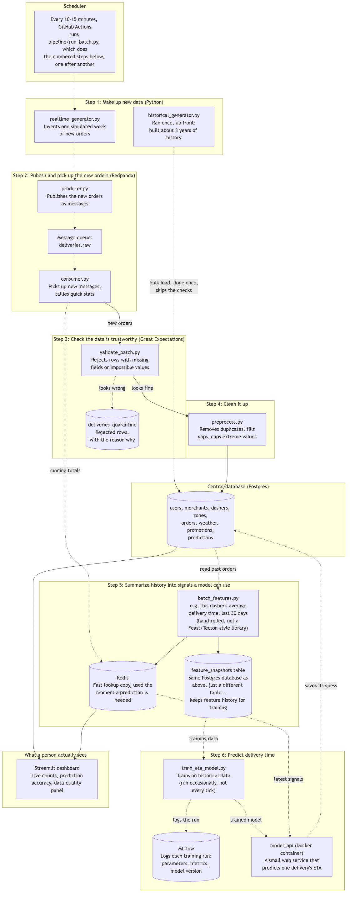

# Food Delivery Marketplace — End-to-End ML Platform (Portfolio Project)

A simulated, DoorDash-style food delivery marketplace built end-to-end: synthetic
data generation (historical + accelerated real-time), a star-schema data
warehouse, stream processing, a data-contract-gated ML pipeline with a feature
store, a containerized model service, and a live dashboard.

This document is maintained incrementally as the project is built, so it
always reflects current state — not a retrospective writeup.

## Purpose & audience

Built as a portfolio piece to demonstrate end-to-end ML/data engineering
skills to recruiters/interviewers: everything from data modeling through
deployment, with a live link a reviewer can open without the author present.

## Architecture decisions

- **Delivery**: deployed with a live public link (not just local docker-compose).
- **Streaming**: a Python consumer doing windowed aggregation on Redpanda
  (Kafka-API compatible). Real Kafka Streams (JVM) is an explicit future upgrade.
- **Redpanda hosting**: no persistent hosted broker. Investigated Redpanda
  Cloud's "Serverless" free tier and found it's a 30-day/$100-credit *trial*,
  not a persistent free tier — clusters suspend after the trial and data is
  permanently deleted after a 7-day grace period unless you add a card and
  start paying. Since `producer.py` publishes and `consumer.py` consumes
  within the same pipeline tick (nothing needs to persist *between* ticks),
  Redpanda only needs to be alive for the ~30 seconds each scheduled run
  takes — so it runs as a **GitHub Actions service container**, spun up
  fresh for each cron-triggered workflow run and torn down when it
  finishes. Zero persistent infrastructure, zero trial-expiry risk, and it
  matches the actual usage pattern better than a hosted broker would.
- **Pipeline trigger**: a scheduled batch job (GitHub Actions cron), not an
  always-on worker — each tick generates one "accelerated week" of data,
  fitting the project's compressed-time framing and keeping hosting near-free.
- **UI**: Streamlit, for build speed.
- **Data model**: a proper star schema (fact + dimension tables), not a flat
  orders table — see the Data Dictionary below.
- **ML lifecycle**: explicit preprocessing/cleanup, Great Expectations data
  contracts, feature engineering, a feature store (online + offline), then
  prediction — modeled as a bronze → contract gate → silver → features →
  predictions ("gold") pipeline.

## System architecture



*Source: [`docs/architecture.mmd`](docs/architecture.mmd) (Mermaid). Rendered
to the PNG above as a static image so it displays consistently everywhere —
mermaid's live-rendering support varies a lot across markdown viewers. If
you edit the source, regenerate the image with:*
```
npx -y @mermaid-js/mermaid-cli -i docs/architecture.mmd -o docs/architecture.png -w 1600 -b white
```

**What actually happens on one tick** (every 10-15 minutes):
1. The scheduler runs `pipeline/run_batch.py`, which calls each script below
   in order.
2. **Make up new data** — `realtime_generator.py` invents about one
   simulated week's worth of new orders (that's the "accelerated" part of
   accelerated real-time; the actual clock only moved 10-15 minutes, but the
   simulated marketplace moved forward a week). The historical generator, by
   contrast, only ever ran once, up front, to build ~3 years of backstory —
   it loads straight into the database and skips every check below, since
   it's a one-time trusted seed, not an ongoing feed.
3. **Publish and pick them up** — those new orders get dropped into a
   message queue (Redpanda — think of it as a mailbox other programs can
   check), then picked up by a consumer that does two things at once: keeps
   a running tally of live stats, and passes the actual orders onward.
4. **Check the data is trustworthy** — before anything is allowed into the
   permanent database, Great Expectations checks it for missing fields and
   impossible values (e.g. a negative prep time). Anything that fails gets
   set aside in a "rejected" table with the specific reason, instead of
   silently corrupting the data.
5. **Clean it up** — rows that passed the check still get deduplicated and
   have extreme outlier values capped, before finally landing in the
   database.
6. **Summarize history into signals a model can use** — a feature step turns
   raw order history into the specific numbers a prediction model actually
   needs (e.g. "this dasher's average delivery time over the last 30
   days"). That gets saved in two places for two different jobs: Redis, for
   instant lookup the moment a live prediction is needed, and
   `feature_snapshots` — a table in that *same* Postgres database, not a
   separate system — that keeps the same numbers around, dated, for
   training. This is hand-rolled (our own code), not a named feature-store
   library like Feast — a deliberate choice to keep the concept demonstrable
   without the extra setup that library would add.
7. **Predict delivery time** — a small model (trained ahead of time, not on
   every tick) reads those signals and guesses how long a delivery will
   take, then saves that guess back to the database. Each training run also
   logs its parameters, metrics, and model version to MLflow, so different
   training attempts can be compared later — this is experiment *tracking*,
   not a full model registry (promoting a specific version to production is
   still a deferred, later-phase concern).
8. **What a person sees** — the dashboard reads straight from the database
   and Redis to show live order counts, how accurate the predictions have
   been, and a panel of how much data got rejected in step 4.

## Assumptions

- Data is entirely synthetic; any resemblance to real DoorDash figures is
  illustrative only, not scraped or sourced from a real platform.
- Zones use real US city names/coordinates for recognizability, but all
  entities (users, merchants, dashers, orders) within them are fabricated.
- Weather is a simulated seasonal model (temperature sinusoid + seasonally
  weighted precipitation + rare flash-flood/heatwave spikes) per zone per day,
  not sourced from a real weather API.
- External macro/geopolitical events (fuel price spikes, transit strikes,
  regional flooding emergencies, economic downturns, etc.) are hand-curated
  and sparse, not randomly generated — this keeps them plausible rather than
  statistically arbitrary.
- "Accelerated real-time" means each pipeline run (every ~10-15 min via cron)
  generates and processes roughly one simulated week of new activity, rather
  than a literal continuous stream.
- Order issues (misplaced/not-delivered/wrong-order) and their refunds are a
  generative policy simulation (issue-severity base rate × customer loyalty
  score), not modeled on real DoorDash refund-policy specifics.

## Scale target

- **Geography**: 42 real US metro zones across 36 states/DC, spanning all 9
  US Census regions (New England, Mid-Atlantic, East North Central, West
  North Central, South Atlantic, East South Central, West South Central,
  Mountain, Pacific). Each zone is tagged with state, region, IANA timezone,
  density tier, and real lat/long — see `data-gen/distributions.py`.
- **Timezone awareness**: demand curves (breakfast/lunch/dinner/late-night
  peaks, weekend/holiday bumps) are computed from each zone's *local* time
  via `local_datetime()`, not a shared UTC hour — a zone in Seattle and one
  in Boston hit "lunch peak" at different UTC instants.
- **Historical window**: 2-3 years, seeded once.
- **Volume**: modest per-zone daily order counts (roughly 20-500/day depending
  on zone density tier), targeting **~5-8M `fact_deliveries` rows** total for
  the historical seed — comfortably within free-tier Postgres, fast to
  generate and train on locally. Final validated full 3-year run (42 zones,
  all growth/churn/issue features included): **5,569,206 rows**, ~180s CPU
  time locally, plus accumulated realtime ticks since. `BASE_ORDER_RATE`
  went through several empirical retuning passes as growth/churn/lag effects
  were layered in (a naive first pass landed at only 1.37M rows before a
  ~4.4x retune) — see the Growth/churn section below.
  **Deployed (Neon) scale is intentionally smaller**: Neon's free tier caps
  a project at 512MB, which the full local-scale dataset does not fit in —
  discovered directly (twice) via `psycopg2.OperationalError: could not
  extend file because project size limit (512 MB) has been exceeded`.
  `historical_generator.py` now takes `--order-rate-scale` (a multiplier on
  `BASE_ORDER_RATE`, default 1.0) so the same zones/time-window/growth-curve
  story can be reproduced at a smaller absolute volume without touching the
  fully-validated local dataset or rewriting anything. Computed the scale
  factor from the observed failure point (~280 bytes/row including 4
  indexes, at the exact row count that hit 512MB) targeting a 300MB budget:
  `--order-rate-scale 0.19`. Result: **1,059,324 rows, 280MB total database
  size** — comfortable headroom under the cap for ongoing realtime ticks —
  with the identical growth-then-maturity shape as the local dataset (just
  ~19% the absolute volume) and the same 15.2% late rate.
- **Realism check**: `PROMISED_ETA_BUFFER_MIN` (the padding added on top of
  prep+travel time to produce the "promised" ETA) was tuned from an initial
  5.0 to 8.0 after the real run showed a 40% late-delivery rate — the buffer
  was smaller than the natural variance in pickup-wait time, so lateness was
  basically a coin flip. Verified in Postgres after the fix: **15.3% late**,
  in line with real delivery apps' deliberately-padded ETAs.
- Scaling this up later (more zones, higher per-zone volume, or true
  big-data row counts) is treated as an explicit future phase, likely
  requiring partitioned tables or a Parquet/columnar cold-storage layer —
  not a rewrite of the generators or schema already in place.

## Data Dictionary

**Common generative assumptions** (apply across the tables below unless a
column says otherwise — stated once here rather than repeated per column):

- Every dimension table's population size is scaled by each zone's
  `density_tier` (high/medium/low) — exact per-zone counts are in each
  table's notes below.
- `activation_date` = signup/onboarding date + a short uniform random lag
  (a vetting/ramp-up period): 1-5 days for users, 2-9 for dashers, 3-14 for
  merchants.
- `churn_date` (nullable) is sampled from a Weibull hazard curve (shape
  0.75 = a decreasing hazard rate, the standard "high early risk, tapering
  for loyal entities" retention shape). NULL means still active as of the
  latest generated date. Typical tenure (scale) differs by entity: merchants
  1500 days (stickiest — restaurants don't close as often as people churn),
  users 600 days, dashers 450 days (most volatile — gig-worker turnover).
- `activity_weight` is a fixed-per-entity heterogeneity multiplier —
  lognormal, median 1.0 — sampled once and used to weight random selection
  (some users/merchants/dashers are simply more active/popular than others).
- Entity acquisition timing is a mixture: ~75% follow a logistic (S-curve)
  initial-adoption wave, ~25% trickle in uniformly across the whole window
  (so churn has ongoing replenishment instead of causing terminal decline).
  Merchants/dashers ("supply") lead users ("demand") by a 45-day lag.
- All monetary columns are `NUMERIC`, rounded to 2 decimal places.
- Timestamps are stored as UTC (`TIMESTAMPTZ`), but generated from each
  zone's *local* wall-clock time — a "6pm dinner peak" happens at 6pm local
  time in every zone, not simultaneously in UTC.

### `dim_zones` — the 42 markets

| Column | Type | Description | Generative assumption |
|---|---|---|---|
| `zone_id` | SERIAL PK | Surrogate key | Auto-increment |
| `zone_name` | TEXT | Display name | Same as `city` in this dataset |
| `city` | TEXT | Real US city name | One of 42 hand-picked real US metro areas |
| `state` | TEXT | 2-letter US state code (or DC) | Spans 36 states + DC |
| `region` | TEXT | One of 9 US Census regions | Assigned per city's real geography |
| `timezone` | TEXT | IANA timezone (e.g. `America/New_York`) | Real timezone for that metro; drives all local-time demand logic |
| `density_tier` | TEXT | `low` / `medium` / `high` | Assigned per city by rough real-world population density; drives every other population/order-volume count in the dataset |
| `latitude`, `longitude` | NUMERIC | Real coordinates | Actual lat/long of the city center |

### `dim_users` — customers

| Column | Type | Description | Generative assumption |
|---|---|---|---|
| `user_id` | SERIAL PK | | |
| `signup_date` | DATE | When the user joined | Acquisition mixture (see common assumptions), lagged 45 days behind merchant/dasher acquisition in the same zone |
| `activation_date` | DATE | When the user starts actually ordering | signup_date + uniform(1,5) days |
| `churn_date` | DATE, nullable | When the user stops ordering | Weibull(shape 0.75, scale 600 days) from activation_date |
| `activity_weight` | NUMERIC | Fixed order-frequency heterogeneity multiplier | Lognormal(median 1.0, sigma 0.6) |
| `home_zone_id` | INT FK → `dim_zones` | The user's home zone | Population per zone: 2000 (high) / 1000 (medium) / 400 (low) density tier |
| `acquisition_channel` | TEXT | Marketing channel | Uniform over organic / paid_search / referral / social / push_notification |
| `is_subscriber` | BOOLEAN | DashPass-style subscription flag | Bernoulli(35%) |
| `status` | TEXT | `active` / `inactive` | Derived from `churn_date` |

### `dim_merchants` — restaurants

| Column | Type | Description | Generative assumption |
|---|---|---|---|
| `merchant_id` | SERIAL PK | | |
| `name` | TEXT | Restaurant name | Generated as "{Zone} {Cuisine} Kitchen {n}" |
| `cuisine_type` | TEXT | One of 10 cuisines | Uniform (american, italian, chinese, mexican, indian, japanese, thai, pizza, burgers, cafe) |
| `zone_id` | INT FK | | Count per zone: 150 (high) / 80 (medium) / 30 (low) |
| `baseline_prep_time_min` | NUMERIC | This merchant's typical kitchen speed | Uniform(15, 35) minutes; actual per-order prep time also varies by daypart (peak-hour penalty) |
| `rating` | NUMERIC | Star rating | Normal(4.5, 0.35), clipped to [1, 5] |
| `is_active` | BOOLEAN | Currently operating | Derived from `churn_date` |
| `onboarded_date` | DATE | When the restaurant joined | Acquisition mixture, no lag (merchants/dashers are "supply," lead demand) |
| `activation_date` | DATE | When the restaurant starts fulfilling orders | onboarded_date + uniform(3,14) days (vetting) |
| `churn_date` | DATE, nullable | When the restaurant leaves | Weibull(shape 0.75, scale 1500 days) — stickiest entity type |
| `activity_weight` | NUMERIC | Fixed popularity/selection-weight multiplier | Lognormal(median 1.0, sigma 0.6) |

### `dim_dashers` — delivery drivers

| Column | Type | Description | Generative assumption |
|---|---|---|---|
| `dasher_id` | SERIAL PK | | |
| `signup_date` | DATE | When the dasher joined | Acquisition mixture, no lag |
| `activation_date` | DATE | When the dasher starts accepting deliveries | signup_date + uniform(2,9) days |
| `churn_date` | DATE, nullable | When the dasher stops driving | Weibull(shape 0.75, scale 450 days) — most volatile entity type |
| `activity_weight` | NUMERIC | Fixed capacity/selection-weight multiplier | Lognormal(median 1.0, sigma 0.6) |
| `vehicle_type` | TEXT | bike / scooter / car | Density-tier-weighted (denser zones favor bikes/scooters, sparser favor cars) |
| `home_zone_id` | INT FK | | Count per zone: 300 (high) / 150 (medium) / 60 (low) |
| `rating` | NUMERIC | Star rating | Normal(4.5, 0.35), clipped [1,5] |
| `status` | TEXT | active/inactive | Derived from `churn_date` |

### `dim_promotions` — discounts and offers

| Column | Type | Description | Generative assumption |
|---|---|---|---|
| `promo_id` | SERIAL PK | | |
| `promo_type` | TEXT | discount_pct / flat_discount / free_delivery / bogo | Uniform over the 4 types |
| `discount_pct` | NUMERIC, nullable | % off (discount_pct only) | Uniform(10, 40)% |
| `flat_amount` | NUMERIC, nullable | $ off (flat_discount only) | Uniform($3, $10) |
| `merchant_id` | INT FK, nullable | NULL = platform-wide | 40% platform-wide, 60% merchant-specific |
| `start_date`, `end_date` | DATE | Active window | Random start in the historical window; duration uniform(7, 28) days |

300 total promotions in the historical seed; applied to ~30% of orders with an eligible active promo at order time.

### `dim_date` — calendar dimension

| Column | Type | Description | Generative assumption |
|---|---|---|---|
| `date_key` | BIGINT PK | Format `YYYYMMDDHH` | Hourly grain — one row per (date, hour) |
| `full_date` | DATE | Calendar date | |
| `day_of_week`, `is_weekend` | | | Derived from `full_date` |
| `is_holiday` | BOOLEAN | | Matches a small hand-picked list of fixed-date US holidays |
| `month`, `year`, `hour` | | | Derived |
| `daypart` | TEXT | breakfast/lunch/dinner/late_night | Derived from hour (6-11 / 11-15 / 15-21 / else) |

Represents each zone's *local* wall-clock date/hour — the same `date_key`
means "6pm local" for every zone, even though that's a different UTC instant
in each.

### `fact_weather_daily` — simulated daily weather

| Column | Type | Description | Generative assumption |
|---|---|---|---|
| `weather_id` | BIGSERIAL PK | | |
| `zone_id`, `date` | | One row per zone per day | |
| `precipitation_mm` | NUMERIC | Rainfall | ~25% base daily rain probability (seasonally adjusted by month); Gamma(shape 2, scale 6) mm if it rains, else 0 |
| `temp_high_c`, `temp_low_c` | NUMERIC | Daily temperature range | Annual sinusoid parameterized by the zone's latitude (colder/bigger swings further north) + daily noise |
| `wind_speed_kmh` | NUMERIC | | Gamma(shape 2.5, scale 6) |
| `condition` | TEXT | clear/rain/storm/snow | Derived from precipitation + temperature thresholds |
| `is_flash_flood` | BOOLEAN | | `precipitation_mm > 45mm` |
| `is_heatwave` | BOOLEAN | | Summer months + temp exceeding that zone's own seasonal-peak threshold |

Not sourced from a real weather API (see Assumptions).

### `dim_external_events` — macro/geopolitical shocks

| Column | Type | Description | Generative assumption |
|---|---|---|---|
| `event_id` | SERIAL PK | | |
| `event_type` | TEXT | e.g. fuel_price_spike, transit_strike, hurricane_landfall | One of ~19 hand-curated event archetypes (not randomly generated, to stay plausible) |
| `start_date`, `end_date` | DATE | Active window | Spread proportionally across the historical window via fixed offset ratios |
| `affected_state` | TEXT, nullable | NULL = national/platform-wide | |
| `demand_multiplier`, `order_value_multiplier` | NUMERIC | Effect on order volume / order value | Hand-assigned per event (roughly 1.08-1.40 range) |
| `description` | TEXT | Human-readable summary | |

### `fact_deliveries` — the central fact table (grain: one row per delivery)

| Column | Type | Description | Generative assumption |
|---|---|---|---|
| `delivery_id` | BIGSERIAL PK | | |
| `user_id`, `merchant_id`, `dasher_id` | INT FK | Who was involved | Chosen via `activity_weight`-weighted random sampling from the pool *currently active* (`activation_date` ≤ order date < `churn_date`) as of that order's date |
| `zone_id` | INT FK | | |
| `promo_id` | INT FK, nullable | Applied promo, if any | ~30% of orders with an eligible active promo apply it |
| `date_key` | BIGINT FK → `dim_date` | Local hour bucket | |
| `order_ts` | TIMESTAMPTZ | Actual order instant | Local hour + random jitter within the hour, converted to UTC |
| `promised_eta_min` | NUMERIC | ETA shown to the customer | prep_time + travel_time + 8.0 min buffer (tuned so ~15% of orders run late, matching real delivery-app padding) |
| `actual_delivery_min` | NUMERIC | Actual delivery time | prep_time + pickup_wait + travel_time + noise |
| `prep_time_min` | NUMERIC | Kitchen time | Gamma around the merchant's `baseline_prep_time_min`, +25% during lunch/dinner peak |
| `pickup_wait_min` | NUMERIC | Dasher wait at the restaurant | Normal(4, 2.5), clipped at 0 |
| `travel_time_min` | NUMERIC | Drive/ride time | Normal, parameterized by zone density tier; mean and variance both stretch under adverse weather |
| `subtotal` | NUMERIC | Order value before fees/discounts | Lognormal by cuisine type, scaled by any active macro-event order-value multiplier |
| `discount_amount` | NUMERIC | | From the applied promo (if any), computed per promo type |
| `delivery_fee` | NUMERIC | | Uniform($1.99, $5.99), waived if a free_delivery promo applies |
| `tip_amount` | NUMERIC | | ~15% of (subtotal − discount), with noise |
| `total_amount` | NUMERIC | What the customer paid | subtotal − discount + delivery_fee + tip |
| `item_count` | SMALLINT | | Poisson(2.2) + 1 |
| `is_late` | BOOLEAN | | Derived: `actual_delivery_min > promised_eta_min` |
| `issue_type` | TEXT, nullable | misplaced / not_delivered / wrong_order | ~4% of orders overall (1% / 1% / 2% respectively), elevated under adverse weather |
| `refund_amount` | NUMERIC | | Issue-severity base % (90% / 100% / 50% respectively) + a customer loyalty bonus (tenure + trailing 180-day order count/GMV), floored at $5, capped at `total_amount` |
| `source` | TEXT | `historical` or `realtime` | Which generator produced this row |

### `fact_predictions` — model predictions (built, validated end-to-end)

| Column | Type | Description |
|---|---|---|
| `prediction_id` | BIGSERIAL PK | |
| `delivery_id` | BIGINT FK | |
| `model_name`, `model_version` | TEXT | |
| `predicted_eta_min` | NUMERIC | |
| `features_snapshot` | JSONB | The exact features used, for reproducibility |
| `scored_at` | TIMESTAMPTZ | |

### `feature_snapshots` — designed, not yet populated (offline feature store)

| Column | Type | Description |
|---|---|---|
| `snapshot_id` | BIGSERIAL PK | |
| `entity_type` | TEXT | dasher/merchant/zone/user |
| `entity_id` | INT | |
| `feature_name`, `feature_value` | | |
| `computed_at` | TIMESTAMPTZ | |

### `deliveries_quarantine` — Great Expectations gate failures (validated working, currently empty pending the live pipeline)

| Column | Type | Description |
|---|---|---|
| `quarantine_id` | BIGSERIAL PK | |
| `raw_record` | JSONB | The original failing row |
| `failed_expectations` | JSONB | Which checks failed and why |
| `batch_id` | TEXT | |
| `quarantined_at` | TIMESTAMPTZ | |

## Folder structure

| Path | Purpose | Status | Contents |
|---|---|---|---|
| `infra/` | Local infrastructure config | Built | `schema.sql` (Postgres DDL for the whole star schema), `docker-compose.yml` (Postgres + Redis + Redpanda + model-api local stack) |
| `data-gen/` | Synthetic data generation | Built | `distributions.py` (shared demand/sampling library), `weather_generator.py` (weather + macro events), `historical_generator.py` (one-time bulk seed), `realtime_generator.py` (stateless accelerated-week tick) |
| `contracts/` | Data contract validation | Built | `expectations/deliveries_suite.py` (Great Expectations suite), `validate_batch.py` (validates a batch, splits pass/quarantine) |
| `streaming/` | Stream processing | Built | `producer.py` (publishes batches to Redpanda), `consumer.py` (windowed aggregation into Redis) |
| `features/` | Feature engineering | Built | `batch_features.py` (computes rolling features from Postgres), `feature_store.py` (Redis online + `feature_snapshots` offline wrapper) |
| `ml/` | Model training + serving | Built | `train_eta_model.py` (scikit-learn + MLflow), `model_api/` (FastAPI app, Dockerfile, `model.joblib` artifact) |
| `pipeline/` | Orchestration + cleanup | Built | `preprocess.py` (dedup/impute/clip/load into `fact_deliveries`); `run_batch.py` (the single entrypoint wiring generate → publish → consume → validate → clean → feature → predict into one tick) |
| `ui/` | Dashboard | Built, visual review pending | `app.py` (Streamlit — KPIs, growth trend, zone demand, predicted-vs-actual, data-quality panel, manual pipeline trigger) |
| `.github/workflows/` | Scheduling | Planned | `pipeline.yml` (GitHub Actions cron, drives the realtime pipeline every ~10-15 min) |
| `docs/` | Documentation assets | Built | `architecture.mmd` (editable Mermaid source for the system diagram), `architecture.png` (rendered static image, embedded in this README for consistent display everywhere) |
| *(repo root)* | Project config & docs | Built | `requirements.txt`, `.env` / `.env.example`, `.gitignore`, `README.md` |

## What each file does (updated as files are added)

- **`requirements.txt`** — pinned Python dependencies: numpy/pandas (data
  generation), psycopg2-binary (Postgres), redis (Redis client), kafka-python
  (Redpanda client), great_expectations (data contracts), scikit-learn/joblib
  (model training), mlflow (experiment tracking), fastapi/uvicorn (model
  API), streamlit (dashboard).
- **`.gitignore`** — excludes Python caches, the local venv, real `.env`
  values, trained model artifacts, and Great Expectations' local build output
  from version control.
- **`.env.example`** — template for required connection strings/URLs
  (Postgres, Redis, Redpanda brokers, model API) with local docker-compose
  defaults; copied to a real `.env` locally, never committed with real values.
- **`infra/schema.sql`** — the star-schema DDL; see the Data Dictionary above
  for the full column-by-column reference.
- **`infra/docker-compose.yml`** — local stack: Postgres 16 (auto-loads
  `schema.sql` on first boot), Redis 7, a single-node Redpanda broker, and a
  `model-api` service (builds from `ml/model_api/Dockerfile`, not yet written).
- **`data-gen/distributions.py`** — the single source of truth for demand
  and seasonality, imported by both the historical and realtime generators
  so they stay statistically consistent. Defines the 42-zone US geography
  (`ZONES`), cuisines, vehicle types, acquisition channels, a holiday list,
  timezone-aware demand weighting (`hourly_order_weight`, `local_datetime`,
  `daypart_for_hour`), and sampling functions for prep time, travel time,
  order value, tips, item count, ratings, S-curve/trickle acquisition timing,
  Weibull churn, activity-weight heterogeneity, and order-issue/refund logic.
- **`data-gen/weather_generator.py`** — simulates a daily weather series per
  zone via `generate_weather_series` (bulk, historical) and
  `generate_weather_for_date` (single day, realtime). Also defines
  `build_external_events` (~19 hand-curated macro/geopolitical events),
  `active_events_for`/`combined_event_multipliers`, and
  `demand_weather_multiplier`/`travel_time_weather_multipliers`/
  `issue_rate_multiplier` to translate weather into demand, travel-time, and
  order-issue effects.
- **`data-gen/historical_generator.py`** — the one-time seed script. Inserts
  all dimensions, weather + external events, then simulates a genuinely
  time-varying marketplace per zone: `ActivePool` (O(1) weighted
  add/remove/select), acquisition timing mixing an S-curve wave with a
  steady trickle (supply leading demand), `UserHistory` (rolling loyalty
  tracking), and order-level issues/refunds. Bulk-inserts in 20k-row batches;
  refuses to re-seed an already-populated database. Takes
  `--years`/`--start-date`/`--end-date`/`--seed` CLI args.
- **`data-gen/realtime_generator.py`** — the accelerated real-time piece. A
  stateless "tick": each invocation reconstructs current marketplace state
  from Postgres (no in-memory state persists between runs). Determines the
  resume point from `MAX(full_date)` in `dim_date`, extends `dim_date` +
  weather for the next ~7 days, adds a light entity trickle, queries the
  *current* active pool fresh per zone, and generates that week's delivery
  records — reusing `distributions.py`/`weather_generator.py` plus several
  functions imported directly from `historical_generator.py` to avoid
  duplicating logic. Writes a JSON batch rather than inserting directly into
  `fact_deliveries` (per the contract-gate architecture — see System
  Architecture above).
- **`contracts/expectations/deliveries_suite.py`** — the Great Expectations
  suite definition for a raw deliveries batch: not-null checks on required
  FK/value columns, sane range checks (e.g. `prep_time_min` 0-180 min,
  `item_count` 1-50), and set-membership checks (`issue_type`, `source`).
  Deliberately scoped to what's cheap/robust to check at ingestion — not
  re-deriving business-logic consistency (e.g. `total_amount` reconciling
  exactly against its components).
- **`contracts/validate_batch.py`** — the contract gate itself. Loads a raw
  JSON batch, runs it through the GE suite via the fluent Pandas-datasource
  API (GE 0.18.x — `context.sources.add_pandas(...)` +
  `get_validator(...)`), and uses each expectation's
  `result["unexpected_index_list"]` to identify *which specific rows* failed
  *which specific checks* — GE's dataset-level expectations still report
  row-level detail when `result_format="COMPLETE"` is set, which is what
  makes per-row quarantine routing possible. Passing rows are written to a
  validated-batch JSON file (ready for the not-yet-built preprocessing/
  cleanup step); failing rows are inserted into `deliveries_quarantine` with
  their specific failed-check names attached, and dropped from the batch.
  **Validated**: ran a real 39,005-row realtime batch through the gate with
  6 deliberately injected violations (null FK, out-of-range value, invalid
  enum member, etc.) — the gate caught exactly those 6, attributed each to
  the correct failed check, and confirmed zero bad rows leaked into the
  passing output.
- **`pipeline/preprocess.py`** — the last step before a validated batch lands
  in `fact_deliveries` (silver). Dedupes on (`user_id`, `merchant_id`,
  `dasher_id`, `order_ts`), median-imputes nulls in nullable numeric fields
  (defensive — this generator never produces them today), clips outliers to
  tighter, realistic bounds than the contract gate's generous sanity bounds
  (e.g. `prep_time_min` to 3-90 min, informed by `distributions.py`'s actual
  sampling parameters, vs. the gate's 0-180 sanity check), coerces JSON
  round-trip types back to Postgres-ready values, and bulk-inserts.
  **Validated**: ran a real batch with 1 injected duplicate, 1 injected null,
  and 1 injected out-of-contract-bounds-but-unrealistic outlier (150 min prep
  time) — output showed exactly 1 removed/1 imputed/1 clipped, and Postgres
  confirmed the clipped value landed at the 90 min bound with zero nulls.
- **`streaming/producer.py`** — publishes a JSON batch of delivery records to
  the Redpanda topic `deliveries.raw` (via `kafka-python`, since Redpanda is
  Kafka-API compatible).
- **`streaming/consumer.py`** — a batch-style consumer (not a long-running
  service): polls the topic and stops once 5 seconds pass with no new
  messages, matching the pipeline's cron-tick nature rather than continuous
  streaming. Computes windowed metrics (total orders, per-zone demand,
  average promised ETA, late rate, and the simulated date range the batch
  covered — added so the dashboard can show a real date range instead of
  opaque "tick" language) into Redis, and writes the raw consumed batch to
  a JSON file for the contract gate. A consumer group with auto-commit
  means each run only picks up messages published since the last run.
  **Validated end-to-end**: ran the full chain for real — generated a
  38,830-record accelerated week, published it, consumed it (metrics
  correctly landed in Redis: `late_rate_pct=15.29`, per-zone counts summing
  to the total, round-trip integrity confirmed record-for-record against
  the original), passed it through the contract gate (0 quarantined) and
  preprocessing (20 genuine tail-value clips caught on real data, not test
  injections), and confirmed it landed in `fact_deliveries`
  (5,569,206 → 5,608,036 rows). This is the first time every stage from
  generation through Postgres has run together as one real pipeline.
- **`features/feature_store.py`** — thin wrapper over the two feature
  stores: `write_online`/`write_online_batch`/`read_online` (Redis, keyed
  `feature:{entity_type}:{entity_id}:{feature_name}`), and
  `write_offline_snapshots`/`read_latest_offline_snapshot` (the
  `feature_snapshots` Postgres table — the *same* database as everything
  else, just a different table). `read_latest_offline_snapshot` does a
  point-in-time-correct lookup (most recent snapshot at or before a given
  date), which is what training must use to avoid leaking future
  information into past examples.
- **`features/batch_features.py`** — computes rolling 30-day features per
  dasher (`avg_delivery_time_30d`, `delivery_count_30d`), merchant
  (`avg_prep_time_30d`, `late_rate_30d`), and zone (`avg_travel_time_30d`,
  `order_volume_30d`) directly from `fact_deliveries`, and writes each to
  both stores. Hand-rolled (no Feast/Tecton) — a deliberate choice, see
  System Architecture above. Computes a fresh snapshot as of the latest
  order each time it runs, so `feature_snapshots` accumulates a real dated
  history naturally as the pipeline operates going forward, rather than
  requiring a separate historical backfill process — training instead
  computes point-in-time features for historical rows directly via SQL
  window functions against `fact_deliveries` (task #9), which is more
  precise than discrete snapshots would be anyway.
  **Validated** against the real 5.6M-row database: computed 8,538 features
  across 2,098 dashers/2,129 merchants/42 zones in 1.4 seconds (existing
  indexes made this fast despite the row count); spot-checked one dasher's
  `avg_delivery_time_30d` against a manual SQL query, `feature_snapshots`,
  and Redis — all three agreed exactly (49.8716). Confirmed idempotent
  (re-running with no new data doesn't duplicate rows) and confirmed the
  point-in-time lookup correctly returns `None` for a date before any
  snapshot existed (no accidental future-leakage).
  **Bug caught during deployment**: against local Docker Redis, writing
  ~8,500 features took ~1.4s (later ~0.4s). Against Upstash (a real network
  hop instead of localhost), the same run didn't finish inside a 60s
  timeout — `write_online` did one individual `.set()` call per feature,
  and thousands of individual network round trips is a fundamentally
  different cost than thousands of in-memory operations. Fixed by adding
  `write_online_batch` (a Redis pipeline — all writes batched into one
  round trip) to `feature_store.py`; re-run completed in **4.7 seconds**.
  This matters beyond just this one-time population: every future
  scheduled pipeline tick calls this same function against the same remote
  Redis.
- **`ml/train_eta_model.py`** — trains a `HistGradientBoostingRegressor`
  (native categorical support, no one-hot encoding needed) to predict
  `actual_delivery_min`. Training features are computed with genuine
  point-in-time correctness directly against `fact_deliveries` via SQL
  window functions (each dasher/merchant/zone's *prior calendar month*
  stats, via `LAG()` over a monthly aggregation — cheap to compute since
  the aggregation only touches ~75K grouped rows, not all 5.6M), sampled via
  `TABLESAMPLE SYSTEM` for a training-sized subset. Deliberately excludes
  `prep_time_min`/`travel_time_min`/`pickup_wait_min`/`promised_eta_min`/
  `is_late` as features — these compose or derive from the target itself.
  Evaluated on a **time-based** train/test split (train on the past, test on
  the most recent slice), not a random split, matching how the model is
  actually used. Logs params/metrics/the model artifact to MLflow
  (`mlruns/`, local tracking) each run, then saves a `joblib` artifact for
  `model_api` to load.
  **Bug caught before it became a train/serve mismatch**: `hour`/
  `day_of_week` were initially extracted from UTC timestamps, but the
  entire demand model is timezone-aware (lunch/dinner peaks happen at each
  zone's *local* time) — a UTC hour would blur that signal differently per
  zone. Fixed by converting to each zone's local time before feature
  extraction (`groupby("timezone").transform(...)` — verified empirically
  after finding `.dt` accessor doesn't work on the resulting mixed-timezone
  object-dtype column, a real pandas gotcha caught via a quick standalone
  test rather than assumed). The identical conversion had to be replicated
  in `model_api/main.py` at serving time, or training and serving would
  silently disagree — the exact training/serving skew failure mode
  discussed earlier, made concrete. Fixing it improved the real, held-out
  metrics slightly (MAE 9.86→9.75 min, R² 0.342→0.348), confirming it was a
  genuine signal-quality fix, not just cosmetic.
  **Validated real result** (524K-row time-based test set): **MAE 9.75 min,
  RMSE 12.47 min, R² 0.348** — an intentionally modest R², since the
  features that actually compose delivery time (real prep/travel/pickup
  time) are excluded as leakage; a much higher R² would have indicated a
  leakage bug, not a better model.
- **`ml/model_api/main.py`** — FastAPI service (`/health`, `/predict`).
  Given a `delivery_id` already in `fact_deliveries`, looks up what was
  knowable before the delivery happened (dasher/merchant/zone identity,
  static attributes, that day's weather) plus live features from Redis,
  scores it, and persists the prediction (with a full feature snapshot, for
  reproducibility) to `fact_predictions`. Returns `actual_delivery_min`
  alongside the prediction for easy predicted-vs-actual comparison (used by
  the dashboard later).
  **Bug caught**: this environment runs Python 3.9, and pydantic explicitly
  evaluates type annotations for request/response validation — unlike our
  other modules (which use `from __future__ import annotations`, keeping
  annotations as lazy unevaluated strings), pydantic's evaluation triggered
  a real `float | None` PEP 604 syntax error, since that union syntax needs
  Python 3.10+. Fixed with `typing.Optional[float]`.
- **`ml/model_api/Dockerfile`** + **`ml/model_api/requirements.txt`** — a
  slim, service-specific dependency set (not the full project
  `requirements.txt` — no pandas-heavy generation deps, no kafka-python, no
  great_expectations needed just to serve predictions). Pinned to
  `python:3.9-slim` to match the local dev Python version the model was
  actually pickled under, avoiding any risk of subtle pickle/numpy
  incompatibility across Python versions.
  **Validated locally**: built and ran the real container via
  `infra/docker-compose.yml`'s existing `model-api` service, connected to
  the already-running Postgres/Redis containers over the internal Docker
  network — `/health` responded correctly, and `/predict` against a real
  delivery_id returned a prediction *byte-for-byte identical* to the local
  (non-Docker) test, confirming full consistency between dev and
  containerized environments. Both predictions correctly persisted to
  `fact_predictions`.
  **Deployed and validated live**: on Render's free tier (750 hrs/month,
  no card required — chosen over Fly.io, which dropped its free tier
  entirely for new accounts in favor of usage-based billing from day one),
  connected to Neon + Upstash via environment variables. `/health` and a
  real `/predict` call both confirmed working at
  `https://food-delivery-marketplace-ml.onrender.com` — first request took
  ~44s (free-tier cold start after inactivity, expected), the next took
  1.5s. The prediction persisted correctly to the live Neon database with
  its full feature snapshot.
- **`pipeline/run_batch.py`** — the orchestrator: runs one full accelerated
  tick end-to-end by invoking every stage above as its own subprocess (the
  exact same commands already validated by hand, not a reimplementation),
  passing intermediate JSON files through a temp directory. Final step
  samples up to 300 of the tick's newly-inserted deliveries (there can be
  tens of thousands per tick — scoring all of them would take far too long
  for a 10-15 minute cadence) and calls `model_api` to score real
  predictions, skipping gracefully with a warning if the API is unreachable
  rather than failing the whole tick. `preprocess.py` was extended
  (`RETURNING delivery_id`) so the orchestrator knows exactly which
  deliveries this tick actually inserted, rather than guessing from
  timestamps.
  **Validated end-to-end for real** (not a dry run): one full tick — generate
  → publish → consume → validate → clean/load → recompute features → score
  predictions — completed in **32.7 seconds** with zero errors: 39,239 new
  delivery records generated, 0 quarantined, 20 realistic values clipped,
  8,700 features recomputed across 2,159 dashers/2,149 merchants/42 zones,
  and 300 live predictions scored (0 failed). Confirmed in Postgres:
  `fact_deliveries` grew by exactly 39,239 rows, and the 302 live
  predictions-to-date averaged **8.88 minutes of absolute error** —
  consistent with the model's offline-evaluated 9.75 min MAE, a good sign
  the model generalizes to live-scored data rather than being an artifact
  of the held-out test set.
- **`ui/app.py`** — the Streamlit dashboard, in five sections:
  - **KPI row**: total deliveries, active users/merchants/dashers, 30-day
    late rate, prediction MAE.
  - **Most recent simulated week**: live Redis-backed metrics for the last
    pipeline run, labeled with the actual simulated date range it covered
    (e.g. "2026-09-13 to 2026-09-20") rather than opaque "last tick"
    language — `streaming/consumer.py` now computes and stores that date
    range alongside its existing metrics.
  - **Growth over time** + **top zones by demand** + **predicted-vs-actual
    scatter** (with a perfect-prediction reference line).
  - **Model monitoring**: scoring coverage (% of real deliveries actually
    scored — coverage is intentionally partial, ~300/run, not a bug),
    accuracy-over-time trend, a residual-distribution histogram (checks for
    systematic over/under-prediction bias), and error broken down by
    weather condition and zone density — sliced directly from each
    prediction's stored `features_snapshot`, so monitoring never has to
    re-derive anything. This already surfaced a real, sensible finding: MAE
    is measurably worse in bad weather (clear 8.4 min → rain 10.4 → storm
    11.5), which is exactly what you'd want a monitoring panel to catch.
  - **Data overview (EDA)**: date range and days spanned, all-time entity
    counts (not just "active"), and distribution histograms (order value,
    delivery time, item count) sampled via `TABLESAMPLE SYSTEM(1)` — fast
    even against 5M+ rows.
  - **Data quality panel**: contract pass rate + quarantine-reason
    breakdown, using status colors (green/amber/red) reserved for this,
    never reused as a series color.
  A sidebar button runs `pipeline/run_batch.py` live and refreshes the
  page. Colors/chart-form choices follow the project's dataviz skill:
  sequential blue for magnitude, status colors only for data quality, never
  a dual-axis chart.
  **Bugs caught before deployment**: (1) `st.secrets.get(key, default)`
  looks like a safe dict-style lookup but isn't — Streamlit's secrets
  object raises `FileNotFoundError` on *any* access at all when no
  `secrets.toml` exists (exactly the local dev situation, which uses
  `.env`), fixed with an explicit try/except falling back to
  `os.environ`; (2) a `numpy.int64` passed as a histogram's `nbins` (from
  `.max()` on a pandas column) raised a Plotly validation error — fixed
  with an explicit `int()` cast.
  **Validated**: every data-loading function tested directly against the
  real database/Redis (bypassing Streamlit's cache decorators) — this
  actually executes the *entire* script top-to-bottom (module-level
  plotting code included), not just the cached functions, so it's a
  real smoke test, not a partial one. Confirmed correct real results
  throughout: 5.6M+ deliveries, sensible predictions, live metrics matching
  the last pipeline run exactly, the weather/MAE finding above, zero
  quarantine handled gracefully. The server boots and serves successfully.
  **Not yet verified**: actual visual rendering — this environment doesn't
  have a headless-browser tool available, so chart layout/spacing/color
  rendering needs a human look before this is considered fully done.

## Growth, churn & entity heterogeneity

The initial historical run used a flat per-zone order rate with uniformly
random signup dates — meaning no growth trend, and (a real bug) orders could
reference users/merchants/dashers before they'd even signed up. Fixed in
phases:

- **Phase A (done)**: see the Data Dictionary's common assumptions above for
  the `activation_date`/`churn_date`/`activity_weight` mechanics. Order
  volume per zone-day scales with the *active, weight-summed fraction* of
  the eventual population, which is what actually produces a trend.
  - **Validated result** (full 3-year, 42-zone run, 5,569,206 rows): quarterly
    deliveries grow from 154,972 (launch quarter) to a peak of 593,292
    (2025 Q1), then moderate ~25% to 443,718 by the final full quarter — still
    ~2.9x launch volume, read as market-maturity softening rather than
    collapse. Cumulative churn over the window: 66.8% of users, 44.6% of
    merchants, 74.3% of dashers. Late-delivery rate holds at 15.3%, issue rate
    at 4.51%.
  - **Iteration note** (reproducibility in practice): this shape took three
    real full-scale runs to get right — a first pass without any
    replenishment mechanism showed a much sharper ~37% post-peak decline
    (churn compounding with nothing to offset it); adding the trickle
    softened it to ~25%. Each iteration was a cheap reset (`docker-compose
    down -v && up`) + full regenerate (~3-17 min).
  - **Realtime continuity bug**: the realtime generator's first real run
    showed a 2.64x volume discontinuity at the historical/realtime boundary,
    because the "active fraction of the eventual population" concept driving
    historical demand doesn't exist in an open-ended realtime sim. Fixed by
    empirically backing out an "orders per unit of active weight" rate from
    real data (~0.0129, consistent across all three density tiers) and
    scaling demand by each zone's live active-user weight sum instead —
    which also fixed trickle-driven growth not showing up in order volume
    at all. Re-verified within ~4.5% of the historical baseline.
- **Phase B (planned)**: per-entity *trajectories* (as opposed to Phase A's
  fixed-per-entity traits) — order-frequency ramping/plateauing/declining
  over a user's own tenure, AOV/price-point drift, cuisine preference drift,
  rare geography-relocation events, tip-rate drift, promo-affinity drift —
  plus merchant menu items (`dim_menu_items`) and time-varying merchant
  hours / dasher availability patterns.

## Deferred to later phases (not built in v1)

`fact_promo_events` (promo funnel), `fact_dasher_shifts` (supply/utilization),
SCD Type 2 on `dim_merchants`/`dim_dashers`, Feast as a real feature-store
library (staying hand-rolled for v1), drift monitoring, real Kafka Streams,
an MLflow *model registry* (experiment tracking itself is in v1 — see System
Architecture — but promoting a specific version to production is not),
Kubernetes, big-data-scale row counts with partitioned/columnar storage.
